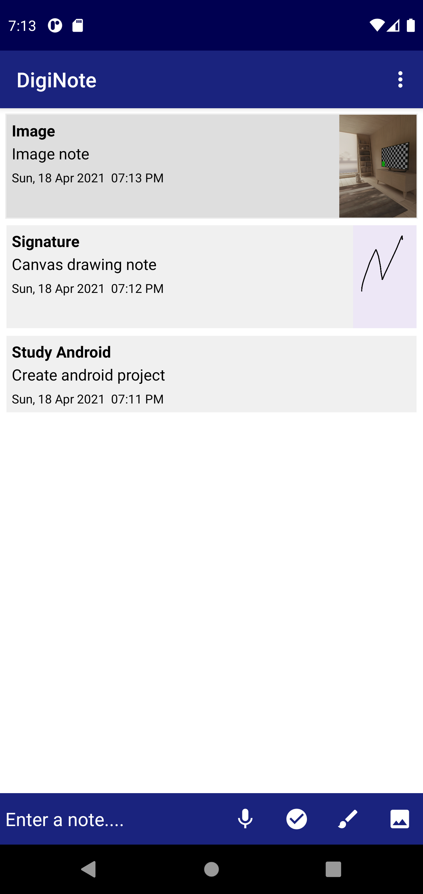
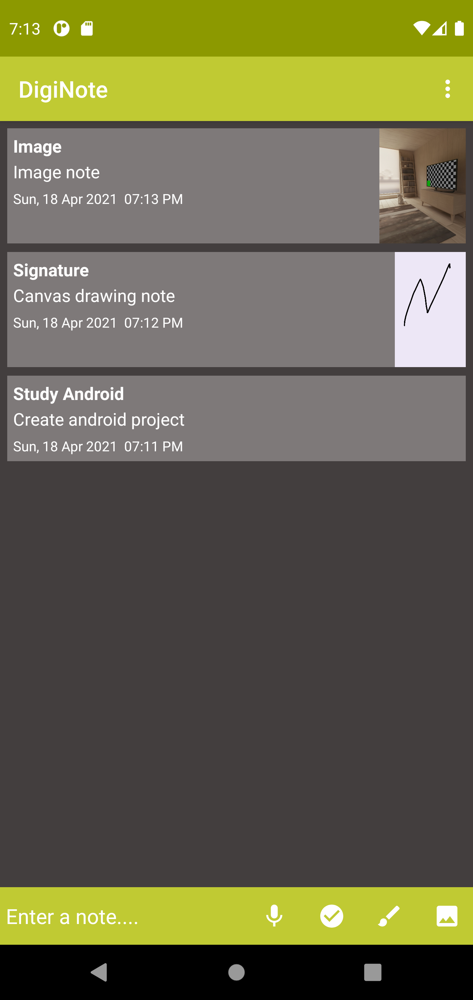
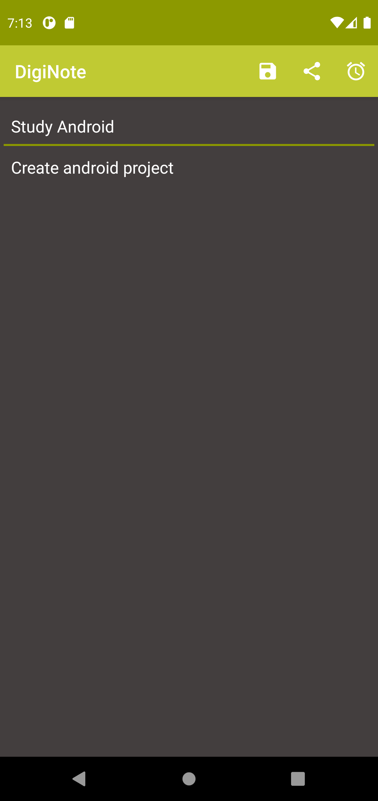
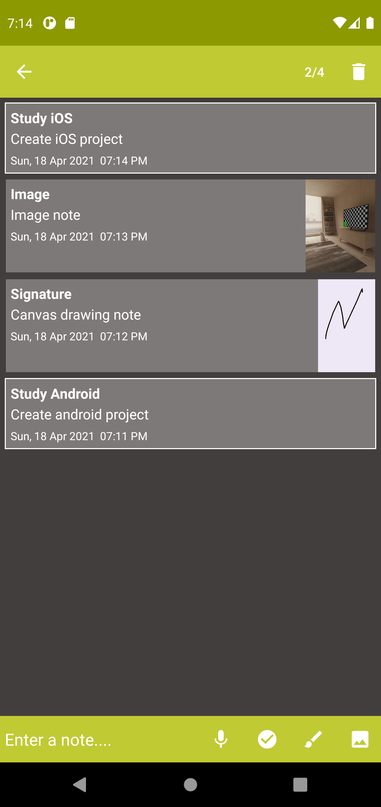

# DigiNote
Simple notepad application where the user can store simple text notes, canvas drawings, images, and checklist as the memo. The application also has Speech-to-Text feature and has support of light and dark mode. The user can share the memo and also has the reminder feature.

**Here are the screenshots:**

